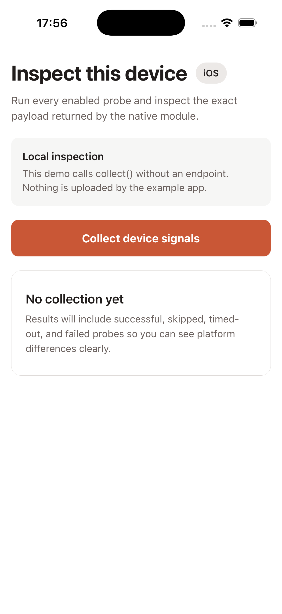
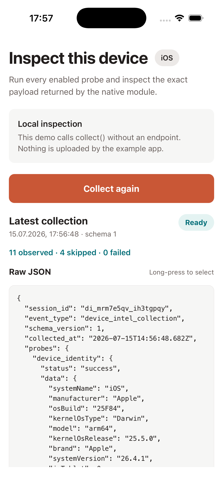
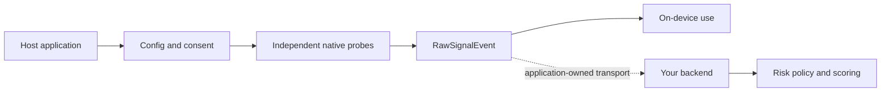

# React Native Device Risk Signals

Open-source React Native TurboModule for collecting raw device intelligence and fraud-prevention
signals on Android and iOS: root and jailbreak indicators, emulator detection, debugger and Frida
traces, VPN and proxy state, hardware, locale, application, and runtime data.

The SDK returns typed raw observations with an independent outcome for every probe. It does not
calculate a risk score, block users, create a persistent device identifier, or upload data. Your
application owns transport, authentication, storage, scoring, and policy.

<p align="center">
  <a href="https://www.npmjs.com/package/react-native-device-risk-signals"></a>
  <a href="https://www.npmjs.com/package/react-native-device-risk-signals"></a>
  <a href="https://github.com/AfanasievN/react-native-device-risk-signals/actions/workflows/ci.yml"></a>
  <a href="https://github.com/AfanasievN/react-native-device-risk-signals/actions/workflows/codeql.yml"></a>
  
  
  
</p>

[Documentation](https://afanasievn.github.io/react-native-device-risk-signals/) · [Quick start](#quick-start) · [What it detects](#what-it-detects) ·
[AI-assisted setup](#ai-assisted-installation-and-integration) · [Example app](#run-the-example) ·
[Probe Catalog](https://afanasievn.github.io/react-native-device-risk-signals/signals/) · [Compatibility reports](docs/DEVICE_COMPATIBILITY.md) ·
[Ask a question](https://github.com/AfanasievN/react-native-device-risk-signals/discussions/categories/q-a) ·
[Share your integration](https://github.com/AfanasievN/react-native-device-risk-signals/discussions/categories/show-and-tell)

**Zero runtime dependencies. No vendor backend. No persistent device ID. No client-side risk score.**

## Quick start

Install the package:

```sh
npm install react-native-device-risk-signals
```

Collect a conservative set of signals locally:

```ts
import {consentFor, DeviceIntel} from "react-native-device-risk-signals";

const deviceIntel = new DeviceIntel({
  sessionId: "checkout-session-42",
  consent: consentFor(["device_identity", "os_integrity", "network", "runtime"]),
});

const event = await deviceIntel.collect();
console.log(JSON.stringify(event, null, 2));
```

`collect()` does not upload the event. Continue to [installation details](#installation), use one of
the [AI setup prompts](#ai-assisted-installation-and-integration), or inspect the included demo.

## See it in action

The repository includes **Signal Bench**, a light-theme example app that runs the library against
the current device and exposes the complete result as selectable JSON.

<p align="center">
  
  &nbsp;&nbsp;
  
</p>

<p align="center">
  <sub>Real screenshots from the included iOS example. The demo never uploads collected data.</sub>
</p>

## Why this library

- **Raw observations, not verdicts.** Your trusted backend owns scoring, policy, and appeals.
- **Failure isolation.** Probes run independently and return `success`, `skipped`, `timeout`, or
  `error`; one slow native call does not fail the collection.
- **Explicit data control.** Disable probes, change timeouts, project fields, and apply a subtractive
  consent gate at initialization or per collection.
- **Local by design.** The package contains no network transport. The host application decides if,
  where, and how a collected event is sent.
- **Android and iOS.** The package uses React Native codegen and autolinking for the New Architecture.

## What it detects

The SDK collects raw observations rather than a single `isRisky` verdict. Availability varies by
platform, OS version, hardware, host-app permissions, and the probes you enable.

| Category | Example signals |
| --- | --- |
| Root and jailbreak | Root-management apps, `su`, modern root/rootless artifacts, writable system paths, jailbreak URL schemes |
| Emulator and tampering | Emulator heuristics, debugger/wait state, dangerous properties, Frida, injected libraries, hook classes |
| Device and application | Model, OS/build time, iOS-on-Mac state, app/provisioning, installer, permissions, split/external APK state |
| Hardware | Screen/display topology, CPU, memory, low-power mode, detailed battery/power, NFC, storage, font digest |
| Network | Transports, validation/captive state, DNS/Private DNS, MTU, VPN, proxy, interfaces, local IP addresses |
| Runtime | Hermes, Fabric, TurboModules, bridgeless mode, debug build, React Native version |
| Locale and context | Language, timezone, location authorization/services, and cached-location source information |
| Optional benchmarks | GPU and audio observations; disabled by default until explicitly enabled |

See [Available signal groups](#available-signal-groups) for probe ids and platform notes.

## Common use cases

- Enrich a backend fraud-prevention or device-risk model with raw mobile observations.
- Add context to login, checkout, account recovery, payment, promotion, or high-risk actions.
- Detect emulator, root/jailbreak, debugger, hooking, VPN, proxy, or repackaging indicators.
- Investigate security telemetry without embedding a client-side risk verdict attackers can patch.
- Run privacy-controlled device research, QA, and compatibility diagnostics.

No individual observation should automatically block a user. Combine signals with authenticated
account, transaction, behavioral, and server-side evidence, and provide an appeal or recovery path
for consequential decisions.

## What this SDK does not do

- It does not calculate a risk score or return a trusted/untrusted verdict.
- It does not replace Google Play Integrity, Apple App Attest, DeviceCheck, or server verification.
- It does not create a persistent cross-reinstall device identifier.
- It does not upload data, fetch remote configuration, or contact a vendor service by default.
- It does not guarantee detection of every rooted, jailbroken, emulated, or instrumented device.
- It is not a substitute for threat modeling, secure backend policy, privacy review, or legal review.

## Compatibility

| Surface | Support |
| --- | --- |
| React Native | `0.76` and newer; CI covers `0.76.9`, `0.81.6`, and `0.86.0` |
| Architecture | TurboModules and codegen; New Architecture only |
| Android | API 24 and newer |
| iOS | Uses the minimum iOS version supported by the host React Native release; CocoaPods integration |
| Expo | Not available in Expo Go; requires a native prebuild or custom development build |
| TypeScript | Typed public API and generated declaration files |
| Data transport | Not included; applications use their existing API client or transport layer |

See the [device compatibility matrix](docs/DEVICE_COMPATIBILITY.md) for automated build coverage,
physical-device reports, and instructions for contributing a sanitized compatibility result.

## Installation

Install the latest public version from npm:

```sh
npm install react-native-device-risk-signals
```

To evaluate unreleased changes from `main`, install the repository directly from GitHub:

```sh
npm install github:AfanasievN/react-native-device-risk-signals#main
```

Install CocoaPods dependencies after adding the package to an iOS app:

```sh
npx pod-install
```

The package supports React Native 0.76 and newer with the New Architecture. Android defaults to API
24 or newer.

## AI-assisted installation and integration

The prompts below are designed for an AI coding assistant that can inspect and edit your current
project. Copy one prompt at a time into the chat attached to your React Native repository. Review the
proposed changes before accepting them, especially native configuration and collected fields.

### Prompt 1: install the library

```text
Install react-native-device-risk-signals in this React Native project.

Before changing files, inspect the repository and determine:
- the package manager and lockfile;
- the React Native version and whether the New Architecture is enabled;
- whether this is a bare React Native app or an Expo project;
- which platforms are present;
- the Android minSdk and the existing iOS CocoaPods/Bundler workflow.

Confirm that the project is compatible with React Native >= 0.76, Android API >= 24, and a native
TurboModule build. Expo Go is not supported; for Expo, use the project's existing prebuild or custom
development-client workflow. Install the package with the repository's package manager, preserve
the existing lockfile strategy, and run CocoaPods using Bundler when the project already uses a
Gemfile. Do not add permissions, remote services, or unrelated dependency upgrades. Run the
project's existing typecheck/tests plus the relevant native dependency checks. Finish with a concise
summary of changed files, commands run, compatibility findings, and any manual step still required.
```

### Prompt 2: integrate signal collection into the project architecture

```text
Integrate react-native-device-risk-signals into this existing React Native application.

First inspect the architecture instead of assuming a template. Identify app bootstrap and lifecycle,
authentication/session ownership, navigation, dependency injection or service modules, state
management, analytics/telemetry conventions, backend API clients, consent/privacy controls, and the
current test strategy. Then choose the smallest integration point that matches those conventions.

Requirements:
- create one reusable DeviceIntel instance or service instead of constructing it throughout the UI;
- use the application's existing session id when available and never derive a persistent device id;
- begin with an explicit, conservative consentFor(...) probe list and explain every enabled group;
- call collect() locally and pass the result to the application's existing API client only when a
  suitable first-party backend endpoint and payload contract already exist;
- handle success, skipped, timeout, and error outcomes without treating missing data as low risk;
- keep risk scoring and blocking decisions on the backend and do not block a user from one signal;
- account for Android/iOS differences, Expo prebuild requirements, and New Architecture codegen;
- minimize retained fields with `fields.include` before handing the event to any transport;
- add focused tests using the project's existing tools and update relevant privacy documentation;
- do not introduce vendor services, secrets, new permissions, or unrelated refactors.

Show the proposed architecture and data flow before editing. After implementation, run the relevant
tests and native checks, then summarize files changed, enabled probes, collected/transmitted fields,
failure behavior, privacy implications, and remaining backend or product decisions.
```

## Collect signals locally

```ts
import {
  consentFor,
  DeviceIntel,
  type RawSignalEvent,
} from "react-native-device-risk-signals";

const deviceIntel = new DeviceIntel({
  sessionId: "checkout-session-42",
  consent: consentFor([
    "device_identity",
    "hardware",
    "os_integrity",
    "locale",
    "runtime",
  ]),
});

const event: RawSignalEvent = await deviceIntel.collect();
```

No endpoint is configured above, so the event remains in your application.

### Real response example

The response below was collected by the included Signal Bench app on an iOS Simulator. Only the
session id, timestamp, and local IP addresses were replaced with safe example values.

<details>
<summary>View the complete JSON response (11 successful probes, 4 skipped)</summary>

```json
{
  "session_id": "demo-session-42",
  "event_type": "device_intel_collection",
  "schema_version": 1,
  "collected_at": "2026-07-15T16:00:43.622Z",
  "probes": {
    "device_identity": {
      "status": "success",
      "data": {
        "systemName": "iOS",
        "manufacturer": "Apple",
        "osBuild": "25F84",
        "kernelOsType": "Darwin",
        "model": "arm64",
        "kernelOsRelease": "25.5.0",
        "brand": "Apple",
        "systemVersion": "26.4.1",
        "isTablet": 0,
        "kernelVersion": "Darwin Kernel Version 25.5.0: Tue Jun 9 22:28:24 PDT 2026; root:xnu-12377.121.10~1/RELEASE_ARM64_T6020"
      }
    },
    "hardware": {
      "status": "success",
      "data": {
        "processorCount": 12,
        "screenBrightness": 0.5,
        "freeMemoryBytes": 146178048,
        "screenDensity": 3,
        "screenHeightPx": 2622,
        "totalMemoryBytes": 34359738368,
        "screenPhysicalHeightPx": 2622,
        "screenWidthPx": 1206,
        "screenPhysicalDensity": 3,
        "screenPhysicalWidthPx": 1206,
        "batteryState": "unknown"
      }
    },
    "fonts": {
      "status": "success",
      "data": {
        "fontsDigest": "def45589933acee661159b4a13123add069a6ba797b7af69f3835fe45df9c922"
      }
    },
    "os_integrity": {
      "status": "success",
      "data": {
        "injectedLibraryNames": [],
        "suBinaryFound": true,
        "suspiciousFilePaths": ["/usr/sbin/sshd", "/usr/bin/ssh"],
        "injectedLibrariesFound": 0,
        "suspiciousFilePathsFound": 1,
        "symbolicLinksSuspicious": false,
        "writableSystemPathFound": false,
        "hookFrameworkFound": 0,
        "developerModeEnabled": false,
        "dyldImageCount": 1010,
        "canOpenJailbreakScheme": false,
        "isDebuggerAttached": false,
        "isEmulator": true,
        "emulatorFingerprintMatch": true,
        "emulatorFilesFound": false,
        "emulatorBuildMarkers": ["target_os_simulator"],
        "emulatorFilePaths": [],
        "emulatorSystemPropertyMarkers": [],
        "emulatorCpuMarkers": [],
        "emulatorVendorMarkers": [],
        "deviceFarmMarkers": ["xctest_environment"],
        "emulatorChecksPerformed": ["build_target", "simulator_environment", "xctest_environment"],
        "simulatorEnvironmentPresent": true,
        "rootManagementAppFound": false
      }
    },
    "os_integrity_frida_scan": {
      "status": "skipped",
      "reason": "disabled"
    },
    "os_integrity_fork_test": {
      "status": "skipped",
      "reason": "disabled"
    },
    "network": {
      "status": "success",
      "data": {
        "connectionType": "wifi",
        "isConnected": 1,
        "localIpAddresses": ["xxx.xx.x.x2"],
        "isVpnActive": false,
        "interfaceNames": [
          "anpi2",
          "anpi1",
          "anpi0",
          "en4",
          "en5",
          "en6",
          "en1",
          "en2",
          "en3",
          "bridge0",
          "en0",
          "awdl0",
          "llw0",
          "utun0",
          "utun1",
          "utun2",
          "utun3",
          "utun4",
          "utun5",
          "utun100"
        ],
        "isProxyConfigured": false
      }
    },
    "telephony": {
      "status": "success",
      "data": {}
    },
    "locale": {
      "status": "success",
      "data": {
        "languages": ["ru-RU", "en-GB"],
        "timezoneOffsetMinutes": 180,
        "calendar": "gregorian",
        "uses24HourClock": 1,
        "groupingSeparator": " ",
        "firstDayOfWeek": 2,
        "decimalSeparator": ",",
        "language": "en",
        "measurementSystem": "metric",
        "country": "RU",
        "timezoneId": "Europe/Moscow",
        "currencyCode": "RUB"
      }
    },
    "geolocation": {
      "status": "success",
      "data": {
        "authorizationStatus": "notDetermined",
        "hasCoarsePermission": false
      }
    },
    "media_bluetooth_apps": {
      "status": "success",
      "data": {
        "isOtherAudioPlaying": false,
        "isScreenMirrored": 0,
        "accessibilityFeatures": [],
        "isScreenCaptured": false,
        "audioOutputRoute": "speaker",
        "accessibilityRunning": 0,
        "openableFlaggedSchemes": []
      }
    },
    "gpu_benchmark": {
      "status": "skipped",
      "reason": "disabled"
    },
    "audio_latency": {
      "status": "skipped",
      "reason": "disabled"
    },
    "runtime_timing": {
      "status": "skipped",
      "reason": "disabled"
    },
    "numeric_consistency": {
      "status": "skipped",
      "reason": "disabled"
    },
    "application": {
      "status": "success",
      "data": {
        "appVersion": "1.0",
        "appBuild": "1",
        "bundleId": "org.reactjs.native.example.DeviceRiskSignalsExample"
      }
    },
    "runtime": {
      "status": "success",
      "data": {
        "isHermes": true,
        "jsEngine": "hermes",
        "hermesVersion": "250829098.0.14",
        "isFabric": true,
        "isTurboModule": true,
        "isBridgeless": true,
        "isDebugBuild": true,
        "reactNativeVersion": "0.86.0",
        "platformOs": "ios"
      }
    }
  }
}
```

</details>

Probe payloads vary by platform, OS version, available hardware, and permissions. Consumers should
branch on `status` before reading `data`. Individual observations are not risk verdicts; for example,
a simulator may expose development artifacts that are expected in that environment.

## Configure collection

Configuration is a plain object. It can be bundled with the app, supplied by your backend, or changed
for an individual flow. The SDK does not fetch configuration itself.

```ts
const deviceIntel = new DeviceIntel({
  config: {
    probes: {
      geolocation: { enabled: false },
      telephony: { enabled: false },
      device_identity: {
        timeoutMs: 300,
        fields: {
          include: ["systemName", "manufacturer", "model", "systemVersion"],
        },
      },
    },
  },
});

const event = await deviceIntel.collect({
  config: {
    probes: {
      network: { enabled: false },
    },
  },
});
```

Per-call configuration is layered over instance configuration. A consent gate is applied last and
can only remove probes; it cannot re-enable a disabled probe. Unknown probe ids, invalid timeouts,
and unknown selected fields throw `ProbeConfigValidationError` instead of being silently ignored.

Validate untrusted or remotely supplied configuration before constructing the SDK:

```ts
import {validateProbeConfig} from "react-native-device-risk-signals";

const issues = validateProbeConfig(candidateConfig);
if (issues.length > 0) {
  // Reject the configuration or report it through the application's own diagnostics.
}
```

### Send with your application API client

The SDK intentionally has no transport. Collect and minimize the event, then use the authenticated
API layer that already owns retries, headers, telemetry, and error handling in your application:

```ts
const event = await deviceIntel.collect();
await appApi.post("/v1/device-signals", event);
```

Do not place credentials or vendor endpoints in SDK configuration. The application decides whether
an event should be sent and how delivery failures are handled.

## Available signal groups

| Group          | Probe ids                                                           | Notes                                                       |
| -------------- | ------------------------------------------------------------------- | ----------------------------------------------------------- |
| Device and app | `device_identity`, `application`, `device_security_posture`         | Device/OS identity, app provenance, and security posture     |
| Hardware       | `hardware`, `gpu_benchmark`, `audio_latency`                        | GPU and audio benchmarks ship disabled                      |
| Integrity      | `os_integrity`, `os_integrity_frida_scan`, `os_integrity_fork_test` | The fork test is iOS-only and ships disabled                |
| Runtime        | `runtime`, `fonts`, `runtime_timing`, `numeric_consistency`          | Active computation probes ship disabled                     |
| Connectivity   | `network`, `telephony`                                              | Availability depends on platform and OS restrictions        |
| Context        | `locale`, `geolocation`                                             | Geolocation uses only information available to the host app |
| Media and apps | `media_bluetooth_apps`                                              | Media route, Bluetooth, and finite known-app observations   |
| Transaction    | `transaction_safety`                                               | Point-in-time protection context; ships disabled             |

Some values are opportunistic by design. Unsupported or unavailable information should appear as a
skipped probe or an unavailable value, not be treated as evidence of low risk.

Android application provenance includes the backward-compatible `installerPackage` plus the more
precise `installingPackageName`, `initiatingPackageName`, initiating-installer certificate digests,
Android 13+ package-source class, and Android 14+ update owner when the OS exposes them. These are
installer-supplied observations, not Play Integrity verdicts. Missing values are omitted.

In particular, `mockLocationAppsFound` remains optional for compatibility but is not populated:
enumerating arbitrary mock-location apps would violate the package-visibility boundary. Android
uses `Location.isMock`/`isFromMockProvider` for an available cached fix, while iOS 15+ exposes the
cached location's software-simulation and accessory-source flags.

The same omission rule applies to `usbDebuggingEnabled` and `getTaskAllowEntitlement`. Modern
Android does not provide a trustworthy ordinary-app ADB-state read, and the current public iPhoneOS
headers do not expose the documented `SecTask` entitlement lookup. The SDK reserves both optional
fields but does not manufacture negative values or hand-declare unsupported platform symbols.

## Probe Catalog

`PROBE_CATALOG` is a machine-readable inventory of every probe, including platforms, default state,
sensitivity, permissions, data categories, purpose, notes, and selectable fields.

```ts
import {getProbeDescriptor, PROBE_CATALOG} from "react-native-device-risk-signals";

const network = getProbeDescriptor("network");
const enabledByDefault = PROBE_CATALOG.filter((probe) => probe.enabledByDefault);
```

See the complete backend envelope and field table in the hosted
[Signal Catalog](https://afanasievn.github.io/react-native-device-risk-signals/signals/), download the
[machine-readable probe catalog](https://afanasievn.github.io/react-native-device-risk-signals/probe-catalog.json),
or continue to the detailed [Data Dictionary](docs/DATA_DICTIONARY.md) and transparent
[benchmark methodology and baseline](docs/BENCHMARKS.md).

### Consistency signals

Compare raw values that were already collected without performing extra device reads or producing a
risk score:

```ts
import {DeviceIntel, deriveConsistencySignals} from "react-native-device-risk-signals";

const deviceIntel = new DeviceIntel();
const event = await deviceIntel.collect();
const consistency = deriveConsistencySignals(event, {
  claimedCountry: customerProfile.country,
  expectedTimezoneId: checkoutContext.timezone,
  expectedBundleId: "com.example.mobile",
  expectedAppVersion: "4.2.0",
});

// Example: {localeCountryMatchesClaimed: true, localeMatchesSimCountry: false}
// Missing source values are omitted rather than interpreted as safe or suspicious.
```

Derive explainable arithmetic metrics from the same event without another device read:

```ts
import {deriveObservationMetrics} from "react-native-device-risk-signals";

const metrics = deriveObservationMetrics(event);
// {
//   screenAspectRatio: 2.2222,
//   memoryPressureRatio: 0.75,
//   processUptimeConsistent: true,
//   abiArchitectureConsistent: true,
//   timeoutProbeCount: 0
// }
```

`runtime_timing`, `numeric_consistency`, and `gpu_benchmark` are active, high-entropy probes. They
ship disabled and should be enabled only for calibrated cohorts using per-probe configuration.

## Data flow



## Privacy and responsible use

- The Android library manifest declares no permissions and does not request `QUERY_ALL_PACKAGES`.
- The SDK does not derive a persistent cross-reinstall identifier.
- `client_id`, when used, is supplied by the host application; it is never inferred from the device.
- Consent, retention, disclosure, and lawful-basis requirements remain the integrator's
  responsibility.
- Location, telephony, application visibility, and high-entropy fingerprints should be treated as
  sensitive data.
- Integrity checks inspect only this process, selected filesystem paths, a finite package list, and
  documented system state; they never enumerate every installed application or process.
- Network link properties are read only when the host already has `ACCESS_NETWORK_STATE`; collection
  performs no DNS lookup or outbound request. NFC reads only hardware/adapter state and starts no NFC flow.
- The Apple implementation still uses zero Required-Reason API categories. Provisioning-profile and
  display-topology observations use ordinary bundle/UIKit APIs and display no prompt.
- Do not use the library for covert tracking or as the sole basis for a consequential decision.

Review every enabled probe, platform permission, privacy disclosure, and retention rule before a
production rollout. Higher-risk probes such as GPU benchmarking, audio latency measurement, and the
iOS fork test intentionally ship disabled. `transaction_safety` is also disabled until calibrated on
representative physical devices and reviewed for accessibility-related false positives.

### Android transaction observation

Android obscured-touch observation needs no permission. It starts lazily with the first enabled
`transaction_safety` collection, so collect once when the protected UI opens and again immediately
before committing the action:

```ts
const transactionConfig = {
  probes: {transaction_safety: {enabled: true, timeoutMs: 900}},
};

await deviceIntel.collect({config: transactionConfig}); // Starts the observation window.
// ...the user reviews and confirms the protected action...
const actionContext = await deviceIntel.collect({config: transactionConfig});
```

`obscuredTouchObserved` and `partiallyObscuredTouchObserved` are omitted until a real `ACTION_DOWN`
has been observed. `observedTouchCount: 0` is therefore different from a clean observed touch.

For Android 14 screenshot events or Android 15 screen-recording visibility, the host application may
opt in with install-time permissions in its own manifest:

```xml
<uses-permission android:name="android.permission.DETECT_SCREEN_CAPTURE" />
<uses-permission android:name="android.permission.DETECT_SCREEN_RECORDING" />
```

The library does not declare these permissions and never prompts. Android shows a system notice when
the screenshot callback detects a capture. Enable only the permission and field needed by the host's
documented protected flow.

## Frequently asked questions

### What does React Native Device Risk Signals do?

It collects raw, on-device observations that can support fraud prevention, account protection, and
security decisions. It returns evidence and probe outcomes rather than a single risk score or a
`safe` / `unsafe` verdict.

### Can it detect rooted Android devices and jailbroken iPhones?

It checks multiple root and jailbreak indicators on Android and iOS. No client-side check can
guarantee detection on every device, so treat these signals as part of a layered server-side risk
policy rather than as definitive proof.

### Can it detect emulators, debuggers, Frida, VPNs, and proxies?

Yes, the SDK exposes relevant raw indicators where the operating system and current runtime make
them available. Individual probes may report `success`, `skipped`, `timeout`, or `error`; always
branch on the outcome instead of assuming that every field is present.

### Does it create a device fingerprint or persistent identifier?

No. The SDK does not create a persistent cross-install identifier or combine observations into a
vendor-controlled fingerprint. Some observations can still be high entropy, so the host application
must minimize, disclose, retain, and protect any data it chooses to use.

### Does the SDK upload data?

No. The package contains no network transport. `collect()` returns a local value, and only the host
application can decide to pass that value to its own API client.

### Does it replace Google Play Integrity, Apple App Attest, or DeviceCheck?

No. Platform attestation provides different, often cryptographically stronger guarantees. This
library complements attestation with inspectable device and runtime context; use both when your
threat model requires them.

### Does it work with Expo?

It does not run inside Expo Go because it includes native Android and iOS code. Use an Expo native
prebuild or a custom development build, then validate the generated native projects and supported
React Native version.

### What permissions does it require?

The Android library manifest declares no permissions. Signal availability can still depend on the
host application's existing permissions, platform restrictions, and OS version. Android 14+
screenshot and Android 15+ recording observations require the host to declare their optional
install-time detection permissions; the SDK never displays a runtime prompt. Audit each enabled probe
against your privacy policy and store requirements.

### What happens when a probe is unsupported or fails?

Probes are isolated and return explicit outcomes such as `skipped`, `timeout`, or `error`. One failed
probe does not invalidate the entire collection. Your integration should tolerate partial results
and avoid treating missing data as evidence of fraud.

### Does it support React Native's old architecture?

The package is designed and tested as a TurboModule for React Native's New Architecture. Projects
that still use the legacy architecture should migrate or validate compatibility before adoption.

## Run the example

Install the example independently from the library root:

```sh
cd example
npm install
npm start
```

In another terminal, launch a running emulator, simulator, or connected device:

```sh
npm run android
```

For iOS, install native dependencies before the first run:

```sh
bundle install
cd ios && bundle exec pod install && cd ..
npm run ios
```

See [example/README.md](example/README.md) for environment requirements and troubleshooting notes.

## Development

```sh
npm install
npm run verify
```

When adding a probe, implement both native platforms or an explicit platform fallback, register the
probe in `src/probes/index.ts`, document its privacy impact, and add focused tests.

`npm run build` compiles the JavaScript entrypoint and TypeScript declarations into `lib/`.
`npm pack --dry-run` shows exactly which files would be published. Maintainers should follow
[RELEASING.md](RELEASING.md) for versioning, npm Trusted Publishing, and GitHub Release steps.

## Project status

The project is in early public development. The API and collected fields may evolve before `1.0.0`
and should be reviewed before adopting the library in a production application. See
[CHANGELOG.md](CHANGELOG.md) for release notes.

## Maintainer

The project is maintained by [AfanasievN](https://github.com/AfanasievN). For React Native consulting,
native integrations, architecture, performance, security, or release engineering, start a
conversation through the maintainer's GitHub profile.

## Adoption and feedback

Evaluating the package or already using it in an application?

- Ask integration and architecture questions in
  [Q&A](https://github.com/AfanasievN/react-native-device-risk-signals/discussions/categories/q-a).
- Share a public or anonymized adoption story in
  [Show and tell](https://github.com/AfanasievN/react-native-device-risk-signals/discussions/categories/show-and-tell).
- Submit a sanitized Android or iOS result through the
  [device compatibility form](https://github.com/AfanasievN/react-native-device-risk-signals/issues/new?template=03-device-compatibility.yml).
- Propose a new raw observation through the
  [signal proposal form](https://github.com/AfanasievN/react-native-device-risk-signals/issues/new?template=04-signal-proposal.yml).

Please do not post collected event payloads without reviewing them for sensitive fields. Package
telemetry is intentionally not included, so community reports are the only source of public adoption
and physical-device compatibility evidence.

## Security

This project uses CI, CodeQL analysis for JavaScript/TypeScript, Java/Kotlin, and Objective-C/C++,
native Android and iOS builds, dependency review, Dependabot security updates, and npm provenance
through Trusted Publishing. These checks reduce risk but cannot guarantee that the software is
vulnerability-free. Report suspected vulnerabilities privately as described in
[SECURITY.md](SECURITY.md).

## Contributing

Contributions are welcome. Read [CONTRIBUTING.md](CONTRIBUTING.md) before opening a pull request.
Participation in this project is governed by the [Code of Conduct](CODE_OF_CONDUCT.md).

## License

[MIT](LICENSE) © React Native Device Risk Signals contributors.
