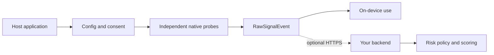

<h1 align="center">React Native Device Risk Signals</h1>

<p align="center">
  Inspect raw device, integrity, network, locale, and runtime signals on Android and iOS.<br />
  Keep scoring and policy decisions on infrastructure you control.
</p>

<p align="center">
  <a href="https://www.npmjs.com/package/react-native-device-risk-signals"></a>
  <a href="https://github.com/AfanasievN/react-native-device-risk-signals/actions/workflows/ci.yml"></a>
  
  
  
</p>

`react-native-device-risk-signals` is a privacy-conscious React Native TurboModule for collecting
device observations. It returns a typed event with an independent outcome for every probe. It does
not assign a risk score, make a trust decision, or upload anything unless you configure a transport.

## See it in action

The repository includes **Signal Bench**, a light-theme example app that runs the library against
the current device and exposes the complete result as selectable JSON.

<p align="center">
  
  &nbsp;&nbsp;
  
</p>

<p align="center">
  <sub>Real screenshots from the included iOS example. The demo has no endpoint configured.</sub>
</p>

## Why this library

- **Raw observations, not verdicts.** Your trusted backend owns scoring, policy, and appeals.
- **Failure isolation.** Probes run independently and return `success`, `skipped`, `timeout`, or
  `error`; one slow native call does not fail the collection.
- **Explicit data control.** Disable probes, change timeouts, project fields, and apply a subtractive
  consent gate at initialization or per collection.
- **Local by default.** `collect()` performs no upload. Network transport is optional and configured
  by the host application.
- **Android and iOS.** The package uses React Native codegen and autolinking for the New Architecture.

## Installation

Install the latest public version from npm:

```sh
npm install react-native-device-risk-signals
```

To evaluate unreleased changes from `main`, install the repository directly from GitHub:

```sh
npm install github:AfanasievN/react-native-device-risk-signals#main
```

Install CocoaPods dependencies after adding the package to an iOS app:

```sh
npx pod-install
```

The package supports React Native 0.71 and newer. Android defaults to API 24 or newer.

## Collect signals locally

```ts
import {
  consentFor,
  DeviceIntel,
  type RawSignalEvent,
} from "react-native-device-risk-signals";

const deviceIntel = new DeviceIntel({
  sessionId: "checkout-session-42",
  consent: consentFor([
    "device_identity",
    "hardware",
    "os_integrity",
    "locale",
    "runtime",
  ]),
});

const event: RawSignalEvent = await deviceIntel.collect();
```

No endpoint is configured above, so the event remains in your application.

### Real response example

The response below was collected by the included Signal Bench app on an iOS Simulator. Only the
session id, timestamp, and local IP addresses were replaced with safe example values.

<details>
<summary>View the complete JSON response (11 successful probes, 4 skipped)</summary>

```json
{
  "session_id": "demo-session-42",
  "event_type": "device_intel_collection",
  "schema_version": 1,
  "collected_at": "2026-07-15T16:00:43.622Z",
  "probes": {
    "device_identity": {
      "status": "success",
      "data": {
        "systemName": "iOS",
        "manufacturer": "Apple",
        "osBuild": "25F84",
        "kernelOsType": "Darwin",
        "model": "arm64",
        "kernelOsRelease": "25.5.0",
        "brand": "Apple",
        "systemVersion": "26.4.1",
        "isTablet": 0,
        "kernelVersion": "Darwin Kernel Version 25.5.0: Tue Jun 9 22:28:24 PDT 2026; root:xnu-12377.121.10~1/RELEASE_ARM64_T6020"
      }
    },
    "hardware": {
      "status": "success",
      "data": {
        "processorCount": 12,
        "screenBrightness": 0.5,
        "freeMemoryBytes": 146178048,
        "screenDensity": 3,
        "screenHeightPx": 2622,
        "totalMemoryBytes": 34359738368,
        "screenPhysicalHeightPx": 2622,
        "screenWidthPx": 1206,
        "screenPhysicalDensity": 3,
        "screenPhysicalWidthPx": 1206,
        "batteryState": "unknown"
      }
    },
    "fonts": {
      "status": "success",
      "data": {
        "fontsDigest": "def45589933acee661159b4a13123add069a6ba797b7af69f3835fe45df9c922"
      }
    },
    "os_integrity": {
      "status": "success",
      "data": {
        "injectedLibraryNames": [],
        "suBinaryFound": true,
        "suspiciousFilePaths": ["/usr/sbin/sshd", "/usr/bin/ssh"],
        "injectedLibrariesFound": 0,
        "suspiciousFilePathsFound": 1,
        "symbolicLinksSuspicious": false,
        "writableSystemPathFound": false,
        "hookFrameworkFound": 0,
        "developerModeEnabled": false,
        "dyldImageCount": 1010,
        "canOpenJailbreakScheme": false,
        "isDebuggerAttached": false,
        "isEmulator": true,
        "rootManagementAppFound": false
      }
    },
    "os_integrity_frida_scan": {
      "status": "skipped",
      "reason": "disabled"
    },
    "os_integrity_fork_test": {
      "status": "skipped",
      "reason": "disabled"
    },
    "network": {
      "status": "success",
      "data": {
        "connectionType": "wifi",
        "isConnected": 1,
        "localIpAddresses": ["xxx.xx.x.x2"],
        "isVpnActive": false,
        "interfaceNames": [
          "anpi2",
          "anpi1",
          "anpi0",
          "en4",
          "en5",
          "en6",
          "en1",
          "en2",
          "en3",
          "bridge0",
          "en0",
          "awdl0",
          "llw0",
          "utun0",
          "utun1",
          "utun2",
          "utun3",
          "utun4",
          "utun5",
          "utun100"
        ],
        "isProxyConfigured": false
      }
    },
    "telephony": {
      "status": "success",
      "data": {}
    },
    "locale": {
      "status": "success",
      "data": {
        "languages": ["ru-RU", "en-GB"],
        "timezoneOffsetMinutes": 180,
        "calendar": "gregorian",
        "uses24HourClock": 1,
        "groupingSeparator": " ",
        "firstDayOfWeek": 2,
        "decimalSeparator": ",",
        "language": "en",
        "measurementSystem": "metric",
        "country": "RU",
        "timezoneId": "Europe/Moscow",
        "currencyCode": "RUB"
      }
    },
    "geolocation": {
      "status": "success",
      "data": {
        "authorizationStatus": "notDetermined",
        "hasCoarsePermission": false
      }
    },
    "media_bluetooth_apps": {
      "status": "success",
      "data": {
        "isOtherAudioPlaying": false,
        "isScreenMirrored": 0,
        "accessibilityFeatures": [],
        "isScreenCaptured": false,
        "audioOutputRoute": "speaker",
        "accessibilityRunning": 0,
        "openableFlaggedSchemes": []
      }
    },
    "gpu_benchmark": {
      "status": "skipped",
      "reason": "disabled"
    },
    "audio_latency": {
      "status": "skipped",
      "reason": "disabled"
    },
    "application": {
      "status": "success",
      "data": {
        "appVersion": "1.0",
        "appBuild": "1",
        "bundleId": "org.reactjs.native.example.DeviceRiskSignalsExample"
      }
    },
    "runtime": {
      "status": "success",
      "data": {
        "isHermes": true,
        "jsEngine": "hermes",
        "hermesVersion": "250829098.0.14",
        "isFabric": true,
        "isTurboModule": true,
        "isBridgeless": true,
        "isDebugBuild": true,
        "reactNativeVersion": "0.86.0",
        "platformOs": "ios"
      }
    }
  }
}
```

</details>

Probe payloads vary by platform, OS version, available hardware, and permissions. Consumers should
branch on `status` before reading `data`. Individual observations are not risk verdicts; for example,
a simulator may expose development artifacts that are expected in that environment.

## Configure collection

Configuration is a plain object. It can be bundled with the app, supplied by your backend, or changed
for an individual flow. The SDK does not fetch configuration itself.

```ts
const deviceIntel = new DeviceIntel({
  config: {
    probes: {
      geolocation: { enabled: false },
      telephony: { enabled: false },
      device_identity: {
        timeoutMs: 300,
        fields: {
          include: ["systemName", "manufacturer", "model", "systemVersion"],
        },
      },
    },
  },
});

const event = await deviceIntel.collect({
  config: {
    probes: {
      network: { enabled: false },
    },
  },
});
```

Per-call configuration is layered over instance configuration. A consent gate is applied last and
can only remove probes; it cannot re-enable a disabled probe.

### Send to your backend

Configure a HTTPS base URL only when the application is ready to transmit an event:

```ts
const deviceIntel = new DeviceIntel({
  transport: {
    baseUrl: "https://api.example.com",
    timeoutMs: 5000,
  },
});

const { event, sent } = await deviceIntel.collectAndSend({
  path: "/v1/device-signals",
});
```

`collectAndSend()` returns the collected event even when delivery fails. Use `sendFields` in a probe
override when the transmitted payload must be narrower than the locally collected payload.

## Available signal groups

| Group          | Probe ids                                                           | Notes                                                       |
| -------------- | ------------------------------------------------------------------- | ----------------------------------------------------------- |
| Device and app | `device_identity`, `application`                                    | Device/OS identity and host application metadata            |
| Hardware       | `hardware`, `gpu_benchmark`, `audio_latency`                        | GPU and audio benchmarks ship disabled                      |
| Integrity      | `os_integrity`, `os_integrity_frida_scan`, `os_integrity_fork_test` | The fork test is iOS-only and ships disabled                |
| Runtime        | `runtime`, `fonts`                                                  | JavaScript runtime and installed-font observations          |
| Connectivity   | `network`, `telephony`                                              | Availability depends on platform and OS restrictions        |
| Context        | `locale`, `geolocation`                                             | Geolocation uses only information available to the host app |
| Media and apps | `media_bluetooth_apps`                                              | Media route, Bluetooth, and finite known-app observations   |

Some values are opportunistic by design. Unsupported or unavailable information should appear as a
skipped probe or an unavailable value, not be treated as evidence of low risk.

## Data flow



## Privacy and responsible use

- The Android library manifest declares no permissions and does not request `QUERY_ALL_PACKAGES`.
- The SDK does not derive a persistent cross-reinstall identifier.
- `client_id`, when used, is supplied by the host application; it is never inferred from the device.
- Consent, retention, disclosure, and lawful-basis requirements remain the integrator's
  responsibility.
- Location, telephony, application visibility, and high-entropy fingerprints should be treated as
  sensitive data.
- Do not use the library for covert tracking or as the sole basis for a consequential decision.

Review every enabled probe, platform permission, privacy disclosure, and retention rule before a
production rollout. Higher-risk probes such as GPU benchmarking, audio latency measurement, and the
iOS fork test intentionally ship disabled.

## Run the example

Install the example independently from the library root:

```sh
cd example
npm install
npm start
```

In another terminal, launch a running emulator, simulator, or connected device:

```sh
npm run android
```

For iOS, install native dependencies before the first run:

```sh
bundle install
cd ios && bundle exec pod install && cd ..
npm run ios
```

See [example/README.md](example/README.md) for environment requirements and troubleshooting notes.

## Development

```sh
npm install
npm run verify
```

When adding a probe, implement both native platforms or an explicit platform fallback, register the
probe in `src/probes/index.ts`, document its privacy impact, and add focused tests.

`npm run build` compiles the JavaScript entrypoint and TypeScript declarations into `lib/`.
`npm pack --dry-run` shows exactly which files would be published. Maintainers should follow
[RELEASING.md](RELEASING.md) for versioning, npm Trusted Publishing, and GitHub Release steps.

## Project status

The project is in early public development. The API and collected fields may evolve before `1.0.0`
and should be reviewed before adopting the library in a production application. See
[CHANGELOG.md](CHANGELOG.md) for release notes.

## Maintainer and collaboration

The project is maintained by [AfanasievN](https://github.com/AfanasievN). I am open to collaboration
on React Native mobile applications, including product architecture, native integrations,
performance, security, and release engineering. If your team is building a mobile product and needs
experienced React Native help, get in touch through my GitHub profile.

## Contributing and security

Contributions are welcome. Read [CONTRIBUTING.md](CONTRIBUTING.md) before opening a pull request.
Report vulnerabilities through a private GitHub security advisory as described in
[SECURITY.md](SECURITY.md).

## License

[MIT](LICENSE) © React Native Device Risk Signals contributors.
